# Battle Dome map gallery

Auto-generated by the **Map gallery** GitHub Action from `src/data/maps.ts` (curated) and `maps/*.txt` (volunteer).
Push changes to those files and this page regenerates itself. For an interactive view like the in-game map browser, open the **[map browser](./index.html)**, or use the [map editor](https://4-mat.github.io/bd-autohost-bot-new/mapeditor/).

**210 maps**

## 1×2 (1)

|  |
| --- |
| 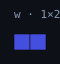 [w](./w.svg) |

## 1×6 (2)

|  |  |
| --- | --- |
| 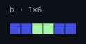 [b](./b.svg) | 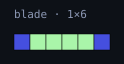 [blade](./blade.svg) |

## 1×7 (1)

|  |
| --- |
| 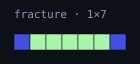 [fracture](./fracture.svg) |

## 2×6 (2)

|  |  |
| --- | --- |
| 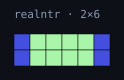 [realntr](./realntr.svg) | 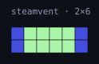 [steamvent](./steamvent.svg) |

## 2×7 (2)

|  |  |
| --- | --- |
| 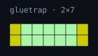 [gluetrap](./gluetrap.svg) | 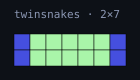 [twinsnakes](./twinsnakes.svg) |

## 3×4 (2)

|  |  |
| --- | --- |
| 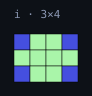 [i](./i.svg) | 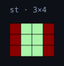 [st](./st.svg) |

## 3×6 (1)

|  |
| --- |
| 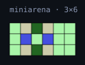 [miniarena](./miniarena.svg) |

## 3×19 (1)

|  |
| --- |
| 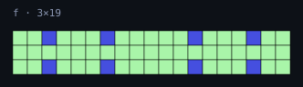 [f](./f.svg) |

## 4×6 (11)

|  |  |  |  |
| --- | --- | --- | --- |
| 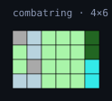 [combatring](./combatring.svg) | 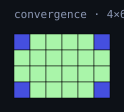 [convergence](./convergence.svg) | 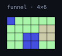 [funnel](./funnel.svg) | 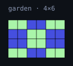 [garden](./garden.svg) |

|  |  |  |  |
| --- | --- | --- | --- |
| 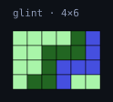 [glint](./glint.svg) | 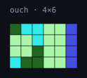 [ouch](./ouch.svg) | 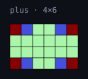 [plus](./plus.svg) | 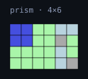 [prism](./prism.svg) |

|  |  |  |
| --- | --- | --- |
| 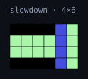 [slowdown](./slowdown.svg) | 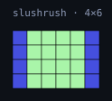 [slushrush](./slushrush.svg) | 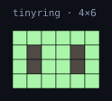 [tinyring](./tinyring.svg) |

## 4×14 (2)

|  |  |
| --- | --- |
| 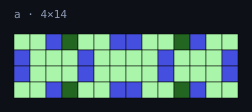 [a](./a.svg) | 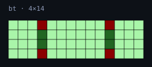 [bt](./bt.svg) |

## 4×44 (1)

|  |
| --- |
| 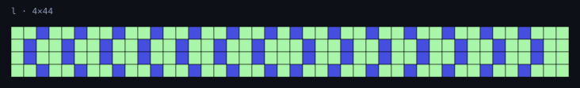 [l](./l.svg) |

## 5×6 (10)

|  |  |  |  |
| --- | --- | --- | --- |
| 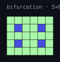 [bifurcation](./bifurcation.svg) | 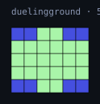 [duelingground](./duelingground.svg) | 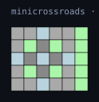 [minicrossroads](./minicrossroads.svg) | 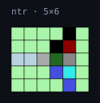 [ntr](./ntr.svg) |

|  |  |  |  |
| --- | --- | --- | --- |
| 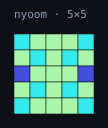 [nyoom](./nyoom.svg) | 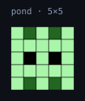 [pond](./pond.svg) | 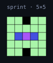 [sprint](./sprint.svg) | 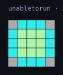 [unabletorun](./unabletorun.svg) |

|  |  |
| --- | --- |
| 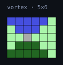 [vortex](./vortex.svg) | 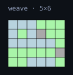 [weave](./weave.svg) |

## 5×7 (3)

|  |  |  |
| --- | --- | --- |
| 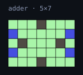 [adder](./adder.svg) | 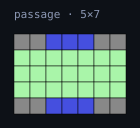 [passage](./passage.svg) | 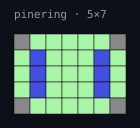 [pinering](./pinering.svg) |

## 7×7 (7)

|  |  |  |  |
| --- | --- | --- | --- |
| 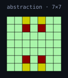 [abstraction](./abstraction.svg) | 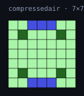 [compressedair](./compressedair.svg) | 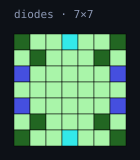 [diodes](./diodes.svg) | 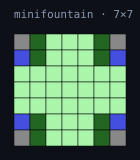 [minifountain](./minifountain.svg) |

|  |  |  |
| --- | --- | --- |
| 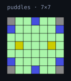 [puddles](./puddles.svg) | 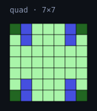 [quad](./quad.svg) | 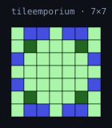 [tileemporium](./tileemporium.svg) |

## 7×13 (7)

|  |  |  |  |
| --- | --- | --- | --- |
| 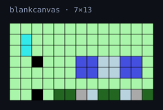 [blankcanvas](./blankcanvas.svg) | 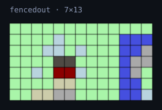 [fencedout](./fencedout.svg) | 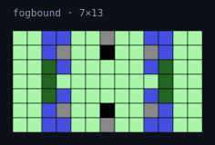 [fogbound](./fogbound.svg) | 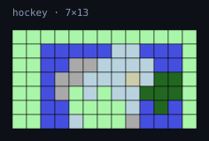 [hockey](./hockey.svg) |

|  |  |  |
| --- | --- | --- |
|  [lagoon](./lagoon.svg) |  [speedbank](./speedbank.svg) |  [trench](./trench.svg) |

## 8×8 (15)

|  |  |  |  |
| --- | --- | --- | --- |
|  [amazeing](./amazeing.svg) |  [blitz](./blitz.svg) |  [demonsheart](./demonsheart.svg) |  [donut](./donut.svg) |

|  |  |  |  |
| --- | --- | --- | --- |
|  [funsized](./funsized.svg) |  [gradient](./gradient.svg) |  [grate](./grate.svg) |  [hiddenpond](./hiddenpond.svg) |

|  |  |  |  |
| --- | --- | --- | --- |
|  [horizon](./horizon.svg) |  [isometry](./isometry.svg) |  [moth](./moth.svg) |  [playhouse](./playhouse.svg) |

|  |  |  |
| --- | --- | --- |
|  [pocketdimension](./pocketdimension.svg) |  [portal](./portal.svg) |  [sunder](./sunder.svg) |

## 8×10 (1)

|  |
| --- |
|  [interlink](./interlink.svg) |

## 8×12 (1)

|  |
| --- |
|  [duplicity](./duplicity.svg) |

## 9×9 (16)

|  |  |  |  |
| --- | --- | --- | --- |
|  [canyon](./canyon.svg) |  [chasm](./chasm.svg) |  [corners](./corners.svg) |  [crossout](./crossout.svg) |

|  |  |  |  |
| --- | --- | --- | --- |
|  [example](./example.svg) |  [farm](./farm.svg) |  [glaciate](./glaciate.svg) |  [hazard](./hazard.svg) |

|  |  |  |  |
| --- | --- | --- | --- |
|  [iceberg](./iceberg.svg) |  [icemistvalley](./icemistvalley.svg) |  [miniring](./miniring.svg) |  [moonplaid](./moonplaid.svg) |

|  |  |  |  |
| --- | --- | --- | --- |
|  [morningcorners](./morningcorners.svg) |  [morningstar](./morningstar.svg) |  [sacredpond](./sacredpond.svg) |  [streamline](./streamline.svg) |

## 9×10 (1)

|  |
| --- |
|  [p](./p.svg) |

## 9×13 (1)

|  |
| --- |
|  [boilerhouse](./boilerhouse.svg) |

## 10×10 (48)

|  |  |  |  |
| --- | --- | --- | --- |
|  [arena](./arena.svg) |  [atlantis](./atlantis.svg) |  [battledome](./battledome.svg) |  [bonecrusher](./bonecrusher.svg) |

|  |  |  |  |
| --- | --- | --- | --- |
|  [breakdown](./breakdown.svg) |  [cityscale](./cityscale.svg) |  [collapsedtemple](./collapsedtemple.svg) |  [corridor](./corridor.svg) |

|  |  |  |  |
| --- | --- | --- | --- |
|  [craterlake](./craterlake.svg) |  [doubleuturn](./doubleuturn.svg) |  [duel](./duel.svg) |  [everywheretorun](./everywheretorun.svg) |

|  |  |  |  |
| --- | --- | --- | --- |
|  [fireplace](./fireplace.svg) |  [flowerlake](./flowerlake.svg) |  [flowingforest](./flowingforest.svg) |  [frown](./frown.svg) |

|  |  |  |  |
| --- | --- | --- | --- |
|  [frozenfate](./frozenfate.svg) |  [geargrind](./geargrind.svg) |  [gelidchamber](./gelidchamber.svg) |  [hidenseek](./hidenseek.svg) |

|  |  |  |  |
| --- | --- | --- | --- |
|  [icepass](./icepass.svg) |  [interceptor](./interceptor.svg) |  [lol](./lol.svg) |  [mistforest](./mistforest.svg) |

|  |  |  |  |
| --- | --- | --- | --- |
|  [moshpit](./moshpit.svg) |  [northpole](./northpole.svg) |  [noturtling](./noturtling.svg) |  [polarregion](./polarregion.svg) |

|  |  |  |  |
| --- | --- | --- | --- |
|  [quadrants](./quadrants.svg) |  [ruins](./ruins.svg) |  [s](./s.svg) |  [sheol](./sheol.svg) |

|  |  |  |  |
| --- | --- | --- | --- |
|  [shrine](./shrine.svg) |  [skytemple](./skytemple.svg) |  [squiggle](./squiggle.svg) |  [stadium](./stadium.svg) |

|  |  |  |  |
| --- | --- | --- | --- |
|  [summit](./summit.svg) |  [sunandmoon](./sunandmoon.svg) |  [swamp](./swamp.svg) |  [trenches](./trenches.svg) |

|  |  |  |  |
| --- | --- | --- | --- |
|  [tundra](./tundra.svg) |  [twinglaciers](./twinglaciers.svg) |  [twinpeaks](./twinpeaks.svg) |  [volcano](./volcano.svg) |

|  |  |  |  |
| --- | --- | --- | --- |
|  [watchtower](./watchtower.svg) |  [weepingvine](./weepingvine.svg) |  [yggdrasil](./yggdrasil.svg) |  [zoom](./zoom.svg) |

## 10×12 (3)

|  |  |  |
| --- | --- | --- |
|  [bands](./bands.svg) |  [koi](./koi.svg) |  [lighter](./lighter.svg) |

## 11×10 (1)

|  |
| --- |
|  [somethingsoff](./somethingsoff.svg) |

## 11×11 (30)

|  |  |  |  |
| --- | --- | --- | --- |
|  [bridge](./bridge.svg) |  [cave](./cave.svg) |  [clover](./clover.svg) |  [colosseum](./colosseum.svg) |

|  |  |  |  |
| --- | --- | --- | --- |
|  [datdoiboimap](./datdoiboimap.svg) |  [datjoiboimap](./datjoiboimap.svg) |  [electriccircuit](./electriccircuit.svg) |  [fortress](./fortress.svg) |

|  |  |  |  |
| --- | --- | --- | --- |
|  [frigidflowers](./frigidflowers.svg) |  [fusioncore](./fusioncore.svg) |  [hallways](./hallways.svg) |  [hiddenlake](./hiddenlake.svg) |

|  |  |  |  |
| --- | --- | --- | --- |
|  [highlands](./highlands.svg) |  [icestorm](./icestorm.svg) |  [islands](./islands.svg) |  [junction](./junction.svg) |

|  |  |  |  |
| --- | --- | --- | --- |
|  [junglemaelstrom](./junglemaelstrom.svg) |  [lavaflows](./lavaflows.svg) |  [madhouse](./madhouse.svg) |  [marsh](./marsh.svg) |

|  |  |  |  |
| --- | --- | --- | --- |
|  [petals](./petals.svg) |  [pullars](./pullars.svg) |  [raincloud](./raincloud.svg) |  [rainstorm](./rainstorm.svg) |

|  |  |  |  |
| --- | --- | --- | --- |
|  [rose](./rose.svg) |  [royalgarden](./royalgarden.svg) |  [snowyvillage](./snowyvillage.svg) |  [sunsets](./sunsets.svg) |

|  |  |
| --- | --- |
|  [tictactoe](./tictactoe.svg) |  [zonestelu](./zonestelu.svg) |

## 11×13 (1)

|  |
| --- |
|  [humangendome](./humangendome.svg) |

## 12×12 (17)

|  |  |  |  |
| --- | --- | --- | --- |
|  [batons](./batons.svg) |  [beams](./beams.svg) |  [bracelet](./bracelet.svg) |  [celticcross](./celticcross.svg) |

|  |  |  |  |
| --- | --- | --- | --- |
|  [forgottenmoldybaconbaguette](./forgottenmoldybaconbaguette.svg) |  [frostbite](./frostbite.svg) |  [hecticgon](./hecticgon.svg) |  [infernus](./infernus.svg) |

|  |  |  |  |
| --- | --- | --- | --- |
|  [krisis](./krisis.svg) |  [market](./market.svg) |  [moat](./moat.svg) |  [pathfinder](./pathfinder.svg) |

|  |  |  |  |
| --- | --- | --- | --- |
|  [shatteredwind](./shatteredwind.svg) |  [steamchamber](./steamchamber.svg) |  [strips](./strips.svg) |  [valleyofthecross](./valleyofthecross.svg) |

|  |
| --- |
|  [windcastle](./windcastle.svg) |

## 13×13 (22)

|  |  |  |  |
| --- | --- | --- | --- |
|  [airlock](./airlock.svg) |  [arcana](./arcana.svg) |  [boarding](./boarding.svg) |  [brimstone](./brimstone.svg) |

|  |  |  |  |
| --- | --- | --- | --- |
|  [canal](./canal.svg) |  [cavern](./cavern.svg) |  [corona](./corona.svg) |  [crackedtop](./crackedtop.svg) |

|  |  |  |  |
| --- | --- | --- | --- |
|  [dugout](./dugout.svg) |  [enthalpy](./enthalpy.svg) |  [finaldestination](./finaldestination.svg) |  [foresttemple](./foresttemple.svg) |

|  |  |  |  |
| --- | --- | --- | --- |
|  [icefortress](./icefortress.svg) |  [mystishaven](./mystishaven.svg) |  [ringoffire](./ringoffire.svg) |  [stonehenge](./stonehenge.svg) |

|  |  |  |  |
| --- | --- | --- | --- |
|  [tunnel](./tunnel.svg) |  [valley](./valley.svg) |  [voltaic](./voltaic.svg) |  [warpzone](./warpzone.svg) |

|  |  |
| --- | --- |
|  [waterfall](./waterfall.svg) |  [wreath](./wreath.svg) |

